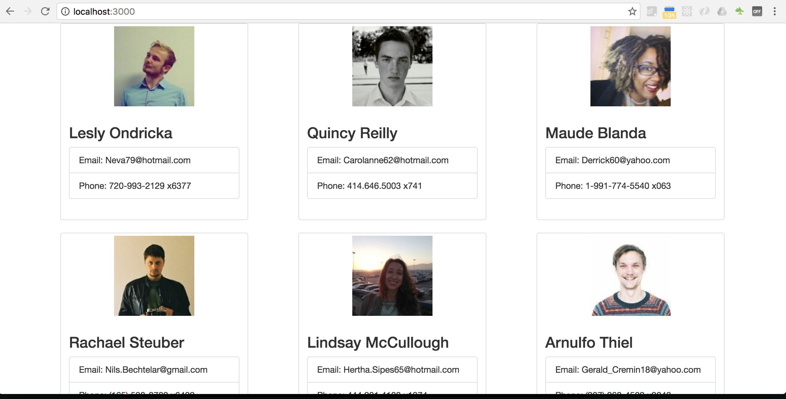

# Employee Directory
Employee directory with react and meteor, and mongo as db.

# Installation
1. $ `npm install`
2. $ `meteor`

Then, browse it with the address
`http://localhost:3000/`

# Screenshoot

